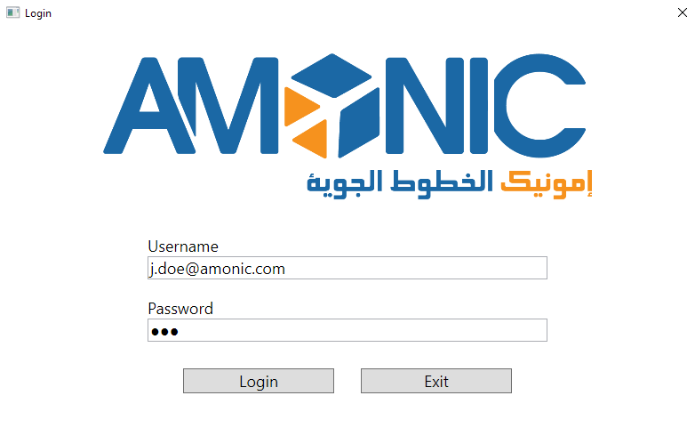
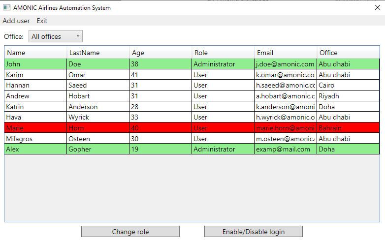
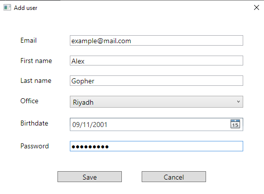
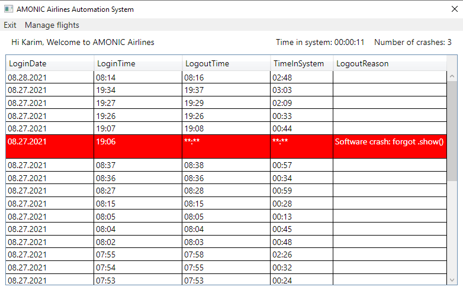
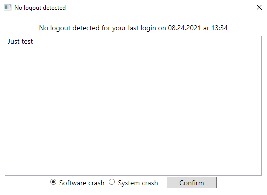
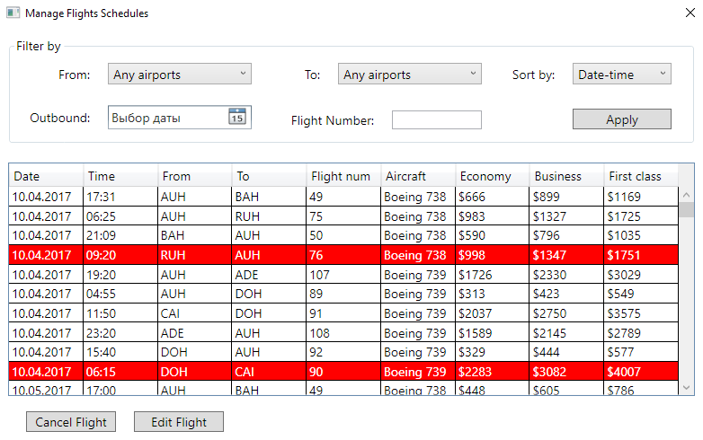
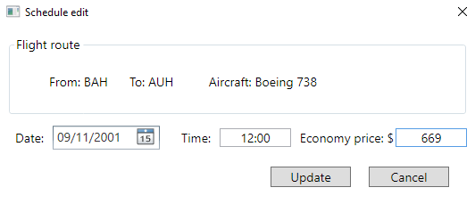

# Amonic Airlines - информационная система аэропорта

Стек технологий: C#, .Net Core, WPF, MySql

## Структура репозитория:

* `AmonicAirlines` - каталог с исходными кодами проекта
* `bin` - каталог с исполняемым файлом проекта
* `res` - каталог с общими ресурсами и техническим заданием на проект

## Как запустить программу?

* Для этого необходимо запустить файл по пути `bin\AmonicAirlines.exe`
* Для авторизации используйте следующие данные: Администратор: `j.doe@amonic.com` `123`. Пользователь: `k.omar@amonic.com` `4258`

## Демонстрация работы программы

### Авторизация

### Окно администратора

### Добавление нового пользователя

### Изменение роли пользователя

### Окно пользователя

### Окно некорректного выхода

### Окно управления рейсами

### Окно изменения информации о рейсе
